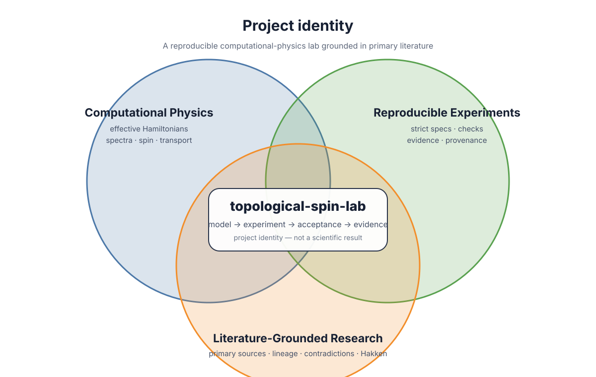
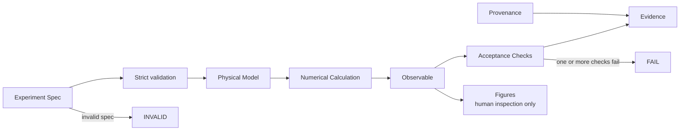
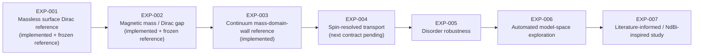

# topological-spin-lab

A small, reproducible computational physics lab for exploring topological and spin-dependent electronic states on consumer PCs.

> **Core question:**  
> Can a consumer PC reproduce, test, and systematically explore the qualitative physics behind magnetically gapped topological surface states?

## Status

**Research / educational software — early development**

**EXP-001** establishes the frozen numerical baseline for a generic massless surface Dirac model. **EXP-002** adds a controlled uniform magnetic mass. **EXP-003** introduces a sign-changing continuum mass wall and verifies the localized chiral bound mode against a known analytic solution.

This repository is built around small experiments with explicit inputs, numerical acceptance criteria, and reproducible evidence.

## At a glance



*Project identity diagram — a navigation aid, not a scientific result.*

The repository sits at the intersection of **computational physics**, **reproducible experiments**, and **literature-grounded research**. Primary sources motivate models and questions; experiment contracts determine what is actually tested; structured evidence records what the code observed.

## Why this project exists

Recent research on magnetic topological materials, including work on NdBi, demonstrates electronic states in which magnetism, topology, momentum, and spin become strongly coupled.

Those experiments require specialized facilities.

This project asks a different question:

**How much of the underlying qualitative physics can be reproduced, inspected, broken, and explored on an ordinary personal computer?**

The goal is not to replace first-principles materials calculations or laboratory measurements.

The goal is to build a small computational laboratory where each physical assumption and numerical result can be inspected.

## Scientific boundary

This repository currently uses **effective models**.

It does **not** claim to:

- reproduce NdBi from first principles
- predict a real material
- demonstrate an experimentally realized spin current
- prove the existence of an edge state without an appropriate model
- replace DFT, ARPES, STM, transport measurements, or experimental validation

NdBi and related magnetic topological systems are scientific inspiration and future comparison targets.

A model being inspired by a material does not make it a model of that material.

## Design principle

The project separates intended experiments, deterministic physics, scientific acceptance, and serialized evidence.



A successful program execution is not automatically a successful physics experiment.

`PASS` is derived from explicit numerical checks. Figures are explanatory artifacts, not the authority for acceptance.

## Experiment states

Every experiment ends in one of four states:

```text
PASS
    Experiment executed and all scientific acceptance checks passed.

FAIL
    Experiment executed, but one or more scientific checks failed.

INVALID
    The experiment specification was invalid and execution did not begin.

ERROR
    A software, runtime, or I/O failure prevented valid evaluation.
```

## EXP-001 — Massless Surface Dirac Reference

EXP-001 establishes the numerical reference model used by later experiments.

The Hamiltonian is

```text
H₀(k) = α (kₓ σᵧ - kᵧ σₓ)
```

with eigenvalues

```text
E± = ± α sqrt(kₓ² + kᵧ²)
```

The canonical experiment uses physical units:

```text
momentum k : Å⁻¹
alpha      : eV·Å
energy     : eV
```

The initial canonical value

```text
alpha = 1.0 eV·Å
```

is a **generic reference parameter**.

It is not an experimentally fitted NdBi parameter.

### EXP-001 acceptance checks

EXP-001 verifies:

- Hamiltonian Hermiticity
- agreement with the independent analytic spectrum
- zero-energy Dirac point
- particle-hole symmetry of the reference model
- normalized spin expectation
- in-plane spin
- spin-momentum orthogonality
- expected helicity
- time-reversal symmetry
- deterministic numerical reproduction

Plots are for human inspection.

They are **not** the authority for PASS/FAIL.

## EXP-002 — Magnetic Mass / Dirac Gap

EXP-002 adds a generic out-of-plane magnetic mass term,

```text
H_m(k) = α (kₓ σᵧ - kᵧ σₓ) + m σ_z
```

with canonical `m = +0.020 eV`, giving a reference direct gap of `0.040 eV`.
The value is deliberately generic and is **not** fitted to NdBi.

EXP-002 verifies the analytic gap, full spin tilt, reduced helicity, explicit
time-reversal breaking, and the `m → -m` time-reversal relation. It does not
claim a QAH state, axion-insulator state, AFM-TI classification, edge state, or
material-specific prediction.

See [`docs/EXP-002.md`](docs/EXP-002.md) for the frozen scientific contract.

## EXP-003 — Continuum Mass-Domain-Wall Reference

EXP-003 promotes the EXP-002 mass from a constant to a smooth sign-changing
profile,

```text
m(x) = m0 tanh(x / w)
```

and verifies the known localized mode of

```text
H = -i alpha sigma_y d/dx - alpha ky sigma_x + m(x) sigma_z
```

without introducing a lattice regulator. The canonical generic parameters are
`alpha = 1.0 eV·Å`, `m0 = 0.020 eV`, and `w = 50 Å`, giving
`xi = alpha/m0 = 50 Å`.

The experiment checks operator residual, normalization/localization, chiral
linear dispersion, in-gap binding, spin, and wall-reversal chirality. It does
not claim an NdBi domain wall, AFM-TI classification, Chern number, quantized
transport, or freedom from artifacts in a future lattice implementation.

See [`docs/EXP-003.md`](docs/EXP-003.md) for the frozen scientific contract
and the Monte Carlo-supported method/sampling decision.

## Repository structure

```text
topological-spin-lab/
│
├── specs/
│   ├── EXP-001.json
│   ├── EXP-002.json
│   └── EXP-003.json
│
├── src/
│   └── topological_spin_lab/
│       ├── models/
│       ├── analytic/
│       ├── observables/
│       ├── experiments/
│       ├── spec.py
│       ├── results.py
│       ├── evidence.py
│       ├── provenance.py
│       └── plotting.py
│
├── tests/
│
├── evidence/
│   └── EXP-001/
│       └── reference/
│
├── docs/
│
└── .github/
    └── workflows/
```

## Reproducibility model

The experiment specification records what was intended.

The resulting evidence records what actually happened.

```text
Intent
  ↓
Experiment Spec
  ↓
Execution
  ↓
Observation
  ↓
Acceptance
  ↓
Evidence
```

Canonical evidence consists of a manifest, numerical metrics, and experiment-specific structured observation tables.

```text
EXP-001 / EXP-002
  manifest.json
  metrics.json
  spectrum.csv
  spin_ring.csv

EXP-003
  manifest.json
  metrics.json
  profile.csv
  dispersion.csv
```

Numerical metrics and structured data are authoritative.

Rendered figures are human-inspection artifacts and are intentionally non-canonical.

Raw eigenvectors are not used as canonical evidence because their global complex phase is not physically observable.

## Installation

Initial versions require only a small Python scientific stack.

```bash
python -m venv .venv
source .venv/bin/activate

python -m pip install --upgrade pip
python -m pip install -e ".[dev]"
```

The canonical runtime begins with Python 3.12.

## Run EXP-001

```bash
python -m topological_spin_lab run \
    specs/EXP-001.json \
    --out runs/EXP-001
```

Exit codes:

```text
0  PASS
1  FAIL
2  INVALID
3  ERROR
```

## Run EXP-002

```bash
python -m topological_spin_lab run \
    specs/EXP-002.json \
    --out runs/EXP-002
```

## Run EXP-003

```bash
python -m topological_spin_lab run \
    specs/EXP-003.json \
    --out runs/EXP-003
```

## Run the tests

```bash
pytest
```

The CI suite must verify both successful physics and intentional failure cases.

The harness is considered incomplete if it can demonstrate PASS but cannot reliably detect broken models or invalid experiments.

## Development philosophy

This project deliberately starts small.

The initial implementation does not include:

- a generic plugin framework
- abstract model hierarchies
- DFT
- AI planners
- databases
- a web interface
- automatic materials discovery
- Kwant-based transport

Capabilities are added only when an experiment requires them.

The current architecture follows:

```text
functional core
+
thin imperative shell
```

Physics functions should remain deterministic and free of filesystem, network, Git, clock, and environment dependencies.

## Planned experiment sequence



Later experiment numbers describe intent, not guaranteed implementation. A roadmap node is **not** an implemented result.

Each stage must earn its way into the repository through a defined experiment and acceptance contract.

## Future direction

A later version may place an automated search or AI planning layer outside the trusted physics core:

```text
Search / Planner
       ↓
Experiment Spec
       ↓
Physics Core
       ↓
Observations
       ↓
Checks
       ↓
Evidence
       ↓
Next proposal
```

The planner may propose experiments.

It does not decide whether its own result is scientifically valid.

## References

Primary scientific references and model-specific sources are maintained in [`docs/REFERENCES.md`](docs/REFERENCES.md).

The source-to-experiment lineage and Hakken questions are tracked in [`docs/LITERATURE_MAP.md`](docs/LITERATURE_MAP.md). Visual-documentation rules are recorded in [`docs/VISUALS.md`](docs/VISUALS.md).

Whenever possible, the repository distinguishes:

```text
SOURCE
OBSERVATION
MODEL ASSUMPTION
NUMERICAL RESULT
INFERENCE
```

## License

Code and repository documentation are released under the MIT License unless otherwise noted.

## Project principle

**A convincing plot is not evidence by itself.**

The objective of this repository is to make small computational physics experiments understandable, reproducible, falsifiable, and inspectable on ordinary hardware.
