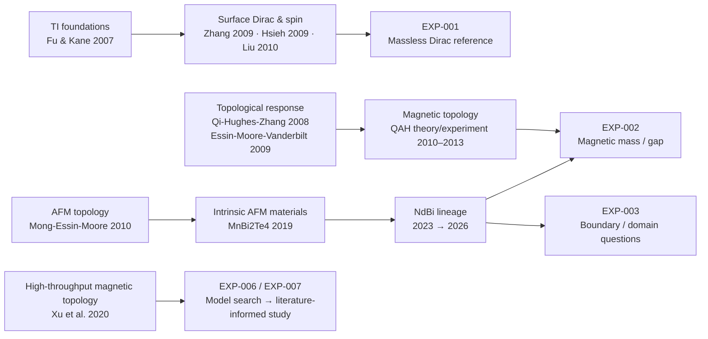

# Literature lineage / Hakken map

This document records how literature connects to the experiment sequence. It is not a claim that every cited result has been reproduced here.

## High-level navigation

The diagram below is a **navigation map, not a formal citation graph**. Detailed source roles and boundaries are documented in [`REFERENCES.md`](REFERENCES.md).

The map uses four layers:

~~~text
SOURCE
  ↓
OBSERVATION / ESTABLISHED RESULT
  ↓
INFERENCE FOR THIS REPOSITORY
  ↓
EXPERIMENT IMPACT
~~~

An INFERENCE is our interpretation and must not be presented as a result of the cited paper.

---

## Chain A — Why EXP-001 begins with a massless surface Dirac reference

SOURCE

- [P-TI-2007] Fu & Kane: 3D topological-insulator classification and protected surface states.
- [P-BI2SE3-2009] Zhang et al.: concrete single-Dirac-cone 3D TI material family.
- [P-SPIN-2009] Hsieh et al.: spin-resolved observation of a spin-momentum-locked Dirac cone.
- [P-MODEL-2010] Liu et al.: explicit model-Hamiltonian derivation and effective surface Hamiltonian.

OBSERVATION / ESTABLISHED RESULT

A useful low-energy description of a time-reversal-symmetric topological surface is Dirac-like, with in-plane spin tied to momentum. Sign conventions depend on coordinate and surface conventions.

INFERENCE FOR THIS REPOSITORY

Before adding magnetism, boundaries, disorder, or real-material parameters, the numerical harness needs a known-answer reference in which spectrum, spin, helicity, and time-reversal symmetry can be checked independently.

EXPERIMENT IMPACT

~~~text
EXP-001
Massless surface Dirac reference
~~~

This is why EXP-001 is generic and analytic rather than an attempted NdBi simulation.

---

## Chain B — Why the next controlled change is magnetism

SOURCE

- [P-TFT-2008] Qi, Hughes & Zhang.
- [P-AXION-2009] Essin, Moore & Vanderbilt.
- [P-QAH-2010] Yu et al.
- [P-QAH-2013] Chang et al.

OBSERVATION / ESTABLISHED RESULT

Breaking the symmetry protecting a massless topological surface state can make a magnetic surface gap physically consequential. Under additional material, dimensional, Fermi-level, and boundary conditions, magnetic topology can support quantized Hall and magnetoelectric phenomena.

INFERENCE FOR THIS REPOSITORY

The cleanest next experiment is not to jump directly to a real magnetic material. Add one explicit magnetic mass term to the trusted EXP-001 reference and verify exactly what changes.

EXPERIMENT IMPACT

~~~text
EXP-001: H0(k)
        ↓ add one explicit magnetic term
EXP-002: magnetic mass / Dirac gap
~~~

A gapped two-band toy model alone will not be described as a QAH material or axion insulator.

---

## Chain C — Why antiferromagnetic symmetry changes the boundary problem

SOURCE

- [P-AFM-2010] Mong, Essin & Moore.
- [P-MBT-AXION-2019] Zhang et al.
- [P-MBT-2019] Otrokov et al.

OBSERVATION / ESTABLISHED RESULT

"Time reversal is broken" does not determine every AFM surface. A combined symmetry involving time reversal and translation can protect some surfaces while other surfaces are gapped.

INFERENCE FOR THIS REPOSITORY

A future boundary experiment cannot honestly be implemented as "put a hard wall around a massive Dirac model and call the result an AFM edge state." The boundary contract must encode which symmetry is preserved or broken.

EXPERIMENT IMPACT

~~~text
EXP-002
uniform magnetic mass
        ↓
boundary/domain contract required
        ↓
EXP-003
boundary / domain-wall / edge-state model
~~~

The exact EXP-003 Hamiltonian remains a separate design decision.

---

## Chain D — The gap controversy is part of the target, not noise to hide

SOURCE

- [P-MBT-GAPLESS-2019] Hao et al.: a gapless surface Dirac cone reported for MnBi2Te4 despite expectations of a magnetic gap.
- [P-NDBI-2023] Honma et al.: domain-selective gapped and gapless Dirac cones in NdBi.
- [P-NDBI-2026] Fukushima et al.: spin-resolved NdBi spectroscopy with a 17 ± 2 meV gap and a direct link between surface magnetic order and gap opening.

OBSERVATION / ESTABLISHED RESULT

Magnetic surface-gap measurements have not always matched simple theoretical expectations. Surface magnetic order, domain structure, surface orientation, bulk-derived states, and measurement resolution matter.

INFERENCE FOR THIS REPOSITORY

A simulator that asks only "did a gap appear?" would discard much of the physics that makes this literature interesting.

Later experiments should retain separate observables for:

~~~text
gap magnitude
spin polarization / spin texture
symmetry status
surface or boundary orientation
state localization
transport, when implemented
~~~

EXPERIMENT IMPACT

This strengthens the separation among model, observable, acceptance, and evidence. An eventual NdBi-inspired experiment must cite every material-specific parameter and record which quantities are measured, fitted, inferred, or assumed.

---

## Chain E — From model-space search to materials search

SOURCE

- [P-SEARCH-2020] Xu et al.: first-principles high-throughput search over magnetic topological materials.

OBSERVATION / ESTABLISHED RESULT

Systematic computational search over magnetic topological materials is possible, but real materials discovery uses substantially richer structure than a few effective-model parameters.

INFERENCE FOR THIS REPOSITORY

Automated parameter search can be useful as a model-space explorer. It should not be called a real-material discovery engine until connected to material-specific electronic structure, symmetry, and validated parameter provenance.

EXPERIMENT IMPACT

~~~text
EXP-005 disorder robustness
        ↓
EXP-006 automated effective-model parameter exploration
        ↓
material provenance boundary
        ↓
EXP-007 literature-informed / NdBi-inspired study
~~~

This keeps "searching a Hamiltonian" distinct from "predicting a material."

---

## Hakken questions opened by the chain

### HAKKEN-01 — Which properties survive abstraction?

If a minimal two-band model reproduces spectrum and spin texture but omits the actual crystal and antiferromagnetic translation symmetry, which conclusions remain valid and which become model artifacts?

Candidate test: maintain an explicit mapping from each observable to the minimum model structure required to interpret it.

### HAKKEN-02 — Can the gap disagreement become a robustness test?

Instead of selecting one magnetic mass, sweep perturbations representing surface-order weakening, chemical-potential shifts, boundary changes, and disorder, then record which observables fail first.

This remains a model-space experiment until perturbations are tied to material evidence.

### HAKKEN-03 — Domain walls may be more diagnostic than uniform surfaces

The AFM-TI lineage suggests that boundaries between regions with different effective mass or symmetry status may reveal more diagnostic physics than a uniform gapped surface.

Candidate consequence: EXP-003 should compare at least one analytically controlled domain-wall construction against any later lattice implementation.

### HAKKEN-04 — Evidence provenance should extend to parameters

When EXP-007 becomes literature-informed, an experiment spec should be able to record:

~~~text
parameter
value
unit
source DOI / source ID
extraction method
uncertainty, if known
measurement / fit / inference / assumption
~~~

This makes literature part of the reproducibility graph.

### HAKKEN-05 — Contradictory literature is valuable evidence

A paper reporting a gapless surface where a simple picture expected a gap is not an inconvenience to filter out. It is a test case for whether the model or measurement contract is missing a controlling variable.

~~~text
agreement    → candidate validation
disagreement → candidate missing variable
~~~

Neither is automatically discarded.

---

## Current literature-to-experiment boundary

As of EXP-001:

~~~text
Literature informs:
  model family
  observables
  conventions to make explicit
  future experiment questions

Literature does NOT yet provide:
  an NdBi parameter fit
  a first-principles NdBi Hamiltonian
  a transport prediction from this repository
  a claim of material discovery
~~~

That boundary moves only through an explicit experiment contract.
